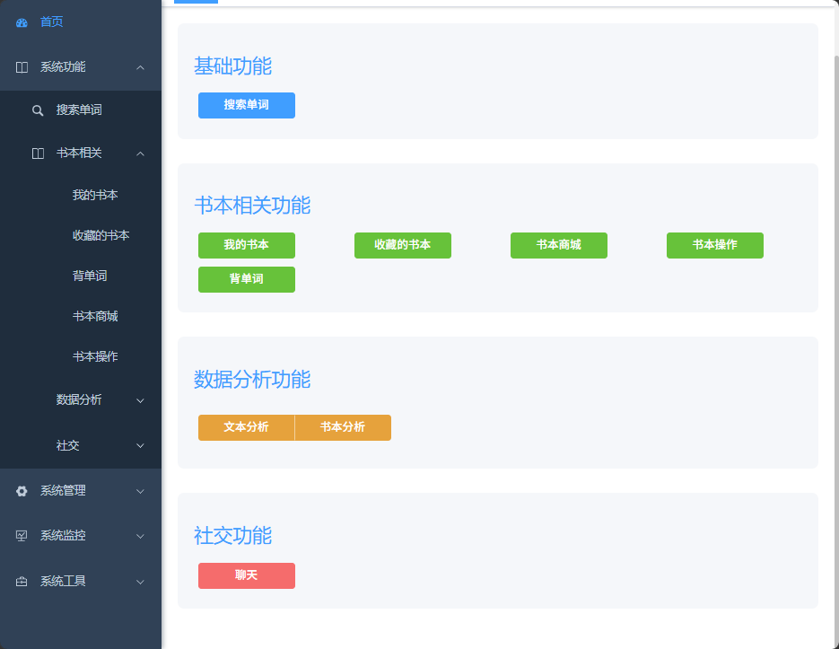
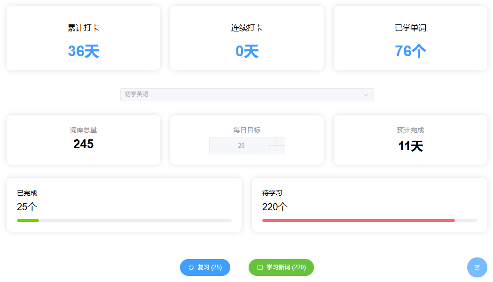
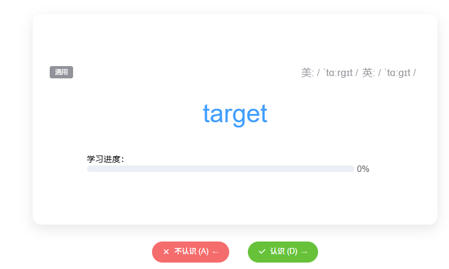
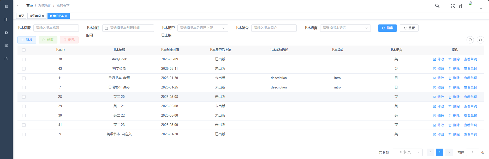
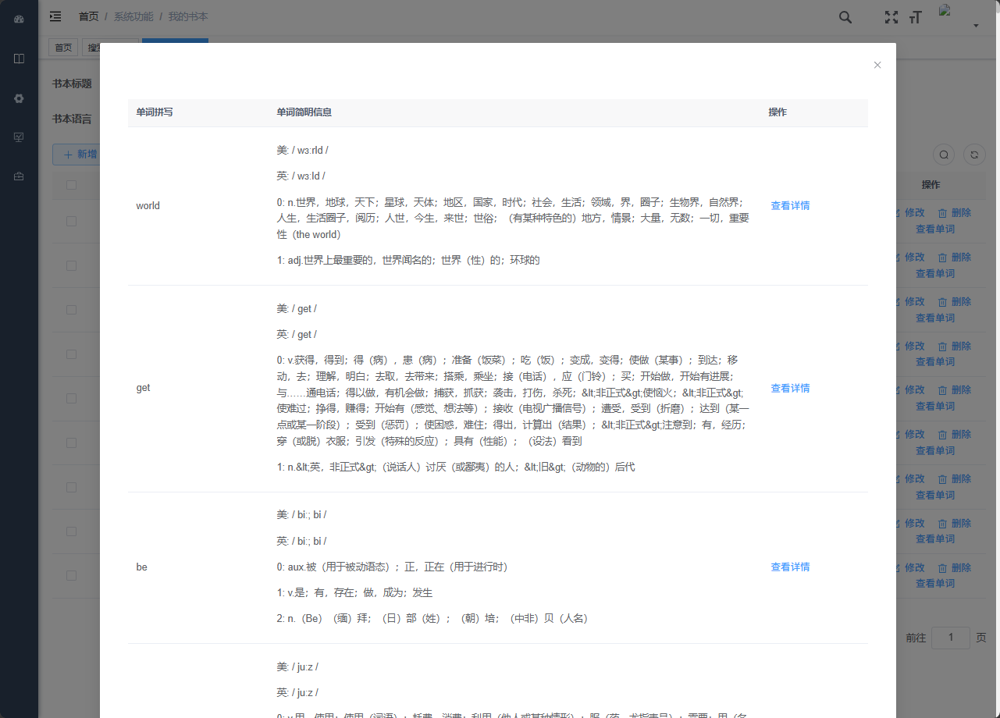
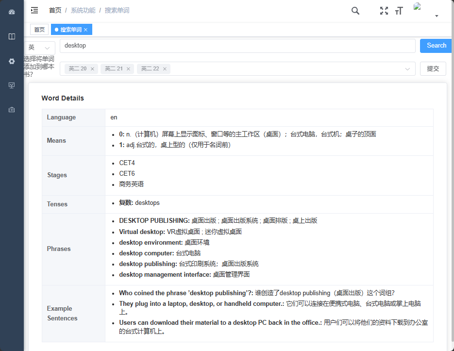
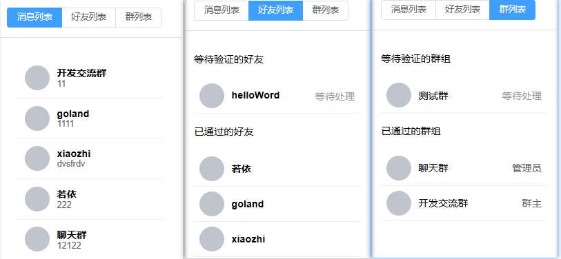
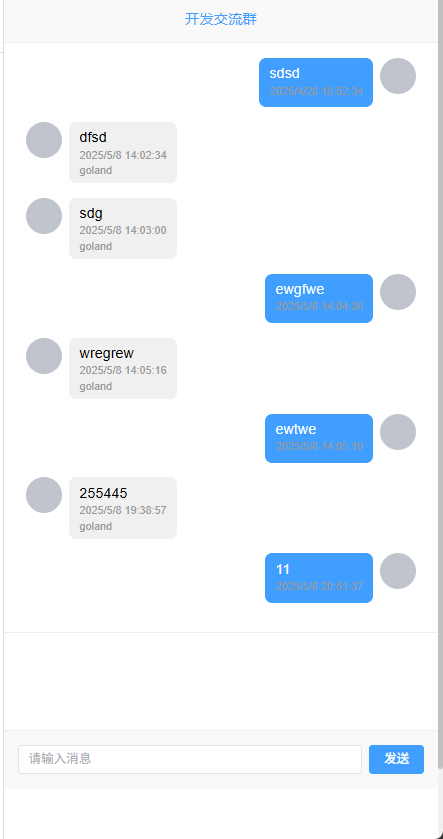
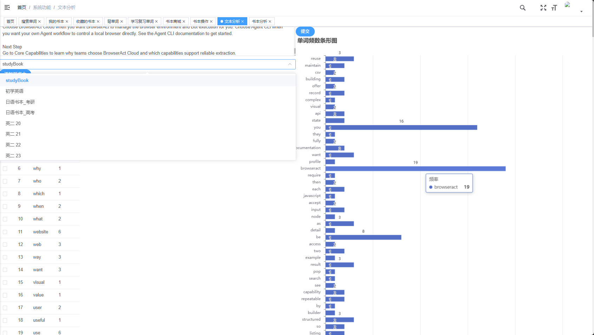

# TotooWord 4 — 单词记忆管理系统

> 基于 [RuoYi](https://gitee.com/y_project/RuoYi-Vue) 二次开发的单词学习与记忆管理平台，提供单词书管理、间隔重复记忆、社交互动等功能。

---

## 项目简介

TotooWord 4 是一款面向英语学习者的 **单词记忆管理系统**。用户可以通过 Web 管理后台维护词库、单词书和学习阶段，移动端 APP / 小程序支持在线背单词、查看例句、练习发音，并内置间隔重复记忆算法帮助高效复习。系统同时集成了好友、群组、实时聊天等社交功能，让学习不再孤单。

### 核心特性

- **词库管理** — 单词、释义、发音、短语、词形变化、例句的全生命周期管理
- **单词书 & 学习阶段** — 自定义单词书，按阶段组织学习内容
- **间隔重复记忆** — 内置记忆算法（`MemorizeController`），科学安排复习计划
- **社交互动** — 好友、群组、实时 WebSocket 聊天，学习打卡互相监督
- **多端覆盖** — Web 管理后台 + UniApp 移动端（APP / H5 / 小程序）
- **权限体系** — 基于 Spring Security + JWT 的 RBAC 权限控制
- **若依内置能力** — 代码生成、定时任务、系统监控、Swagger 接口文档

---

## 演示截图

### 移动端主界面

| 首页 | 学习主页 | 学习卡片 |
|:---:|:---:|:---:|
|  |  |  |

### 单词书与搜索

| 我的单词书 | 单词书详情 | 搜索 |
|:---:|:---:|:---:|
|  |  |  |

### 社交功能

| 社交列表 |消息展示|
|:---:|:---:|
|  |  |

### 数据分析

| 书籍分析（折线图） | 书籍分析（散点图） |
|:---:|:---:|
|  |  |

| 单词分析（柱状图） | 单词分析（饼图） |
|:---:|:---:|
|  |  |

---

## 技术栈

### 后端

| 技术 | 版本 | 说明 |
|------|------|------|
| Java | 1.8 | 运行环境 |
| Spring Boot | 2.5.15 | 应用框架 |
| Spring Security | 5.7.12 | 安全框架 |
| MyBatis | — | ORM |
| MySQL | 5.7+ | 主数据库 |
| Redis | — | 缓存 / Token / WebSocket |
| Druid | 1.2.23 | 数据库连接池 |
| JWT | 0.9.1 | 令牌认证 |
| Swagger | 3.0.0 | 接口文档 |
| PageHelper | 1.4.7 | 分页 |
| WebSocket | — | 实时通信 |

### Web 管理前端

| 技术 | 版本 |
|------|------|
| Vue | 3.4.0 |
| Element Plus | 2.4.3 |
| Vite | 5.0.4 |
| Pinia | 2.1.7 |
| Vue Router | 4.2.5 |
| Axios | 0.27.2 |
| ECharts | 5.4.3 |

### 移动端

| 技术 | 说明 |
|------|------|
| UniApp | 一份代码多端适配（APP / H5 / 小程序） |
| uni-ui | 全端兼容 UI 组件库 |
| Pinia | 状态管理 |

---

## 项目结构

```
TotooWord_4/
├── pom.xml                               # Maven 根配置
├── sql/                                  # 数据库初始化脚本
│   ├── totooworld.sql                   # 业务表（单词、记忆、社交等）
│   ├── ry_20240629.sql                  # RuoYi 系统基础表
│   └── quartz.sql                       # 定时任务表
│
├── totooword_4-admin/                   # 后端 · 启动模块
│   └── src/main/
│       ├── java/com/totoo/
│       │   └── system/controller/       # 业务 Controller
│       │       ├── FunBookController
│       │       ├── FunWordController
│       │       ├── FunMemorizedController
│       │       ├── FunFriendController
│       │       ├── FunGroupController
│       │       ├── FunChatMessageController
│       │       ├── MyWebSocketController
│       │       └── ...
│       └── resources/
│           ├── application.yml          # 主配置
│           ├── application-druid.yml    # 数据源配置
│           └── mapper/                  # MyBatis XML
│
├── totooword_4-framework/               # 后端 · 框架核心（Security、拦截器等）
├── totooword_4-common/                  # 后端 · 通用工具与基础实体
├── totooword_4-system/                  # 后端 · 系统管理模块
├── totooword_4-quartz/                  # 后端 · 定时任务模块
├── totooword_4-generator/               # 后端 · 代码生成模块
├── totooword_4-base/                    # 后端 · 基础预留模块
│
├── totooword4-Vue3-master/              # Web 管理前端（Vue3 + Element Plus）
│   ├── src/api/                         # API 请求
│   ├── src/views/                       # 页面视图
│   ├── src/components/                  # 公共组件
│   └── .env.development                 # 开发环境变量
│
└── RuoYi-App-master/                    # 移动端（UniApp）
    ├── api/                             # 接口封装
    ├── pages/                           # 页面
    │   ├── index.vue                    # 首页
    │   ├── work/index.vue               # 工作台 / 背单词
    │   ├── login.vue
    │   └── mine/                        # 我的（资料、设置等）
    ├── config.js                        # 服务器地址配置
    ├── pages.json                       # 路由与 tabBar
    └── manifest.json                    # 应用配置
```

---

## 快速开始

### 1. 环境准备

| 依赖 | 版本要求 |
|------|---------|
| JDK | 1.8 |
| Maven | 3.6+ |
| MySQL | 5.7 / 8.0 |
| Redis | 5.0+ |
| Node.js | 16+（建议 18 LTS） |
| HBuilderX | 最新版（用于 UniApp 移动端） |

### 2. 初始化数据库

在 MySQL 中创建数据库并依次执行以下脚本：

```sql
CREATE DATABASE IF NOT EXISTS totooword4 DEFAULT CHARACTER SET utf8mb4 COLLATE utf8mb4_general_ci;
USE totooword4;

-- 依次导入（注意顺序）
SOURCE sql/ry_20240629.sql;     -- 若依系统基础表
SOURCE sql/quartz.sql;          -- 定时任务表
SOURCE sql/totooworld.sql;      -- TotooWord 业务表
```

### 3. 修改后端配置

编辑 `totooword_4-admin/src/main/resources/application-druid.yml`：

```yaml
master:
  url: jdbc:mysql://localhost:3306/totooword4?useUnicode=true&characterEncoding=utf8&zeroDateTimeBehavior=convertToNull&useSSL=true&serverTimezone=GMT%2B8
  username: root
  password: <你的数据库密码>
```

编辑 `application.yml` 中的 Redis 配置（如需要）：

```yaml
spring:
  redis:
    host: localhost
    port: 6379
    password: <你的Redis密码>   # 无密码则留空
```

### 4. 启动后端

```bash
# 在项目根目录执行 Maven 构建
mvn clean install -DskipTests

# 进入启动模块运行（端口 8080）
cd totooword_4-admin
mvn spring-boot:run
```

后端启动后：
- Swagger 接口文档：http://localhost:8080/swagger-ui/index.html
- Druid 监控台：http://localhost:8080/druid （默认账号 `ruoyi` / `123456`）

### 5. 启动 Web 管理前端

```bash
cd totooword4-Vue3-master

# 安装依赖
npm install --registry=https://registry.npmmirror.com

# 开发模式启动（Vite 默认 http://localhost:80）
npm run dev
```

开发环境默认通过 Vite 代理将 `/dev-api` 请求转发到 `http://localhost:8080`。

### 6. 运行移动端

推荐使用 **HBuilderX** 打开 `RuoYi-App-master` 目录：

1. 修改 `RuoYi-App-master/config.js` 中的服务器地址，指向你的后端：
   ```js
   const baseUrl = 'http://localhost:8080'
   ```
2. HBuilderX → 运行 → 运行到浏览器（H5） / 运行到手机或模拟器 / 运行到小程序模拟器

---

## 内置功能

### 若依平台基础能力

- 用户管理、部门管理、岗位管理、角色管理、菜单权限
- 字典管理、参数配置、通知公告
- 操作日志、登录日志、在线用户监控
- 定时任务调度、代码生成器
- 服务监控、缓存监控、连接池监视

### TotooWord 业务扩展

| 模块 | 说明 |
|------|------|
| 单词书管理 | 创建/维护单词书，按等级或主题分类 |
| 单词管理 | 单词、音标、释义、短语、词形变化、例句 |
| 学习阶段 | 将单词书划分为多个学习单元 |
| 记忆记录 | 跟踪每个用户的学习进度和已掌握单词 |
| 记忆配置 | 用户自定义每日学习量、复习策略 |
| 间隔重复算法 | 根据遗忘曲线智能安排复习 |
| 好友系统 | 添加好友、查看学习动态 |
| 群组系统 | 创建学习小组、群成员管理 |
| 实时聊天 | WebSocket 即时消息、消息列表 |
| 单词消息 | 单词消息推送与提醒 |

---

## 默认账号

| 系统 | 用户名 | 密码 |
|------|--------|------|
| 若依后台 | admin | admin123 |
| Druid 监控台 | ruoyi | 123456 |
| Swagger | — | 公开访问 |

---

## 许可证

本项目基于 [MIT License](LICENSE) 开源，继承自 RuoYi 框架的开源协议。

---

## 致谢

- [RuoYi](https://gitee.com/y_project/RuoYi-Vue) — 快速开发框架
- [DCloud UniApp](https://uniapp.dcloud.net.cn/) — 跨端移动框架
- [Element Plus](https://element-plus.org/) — Vue3 组件库
